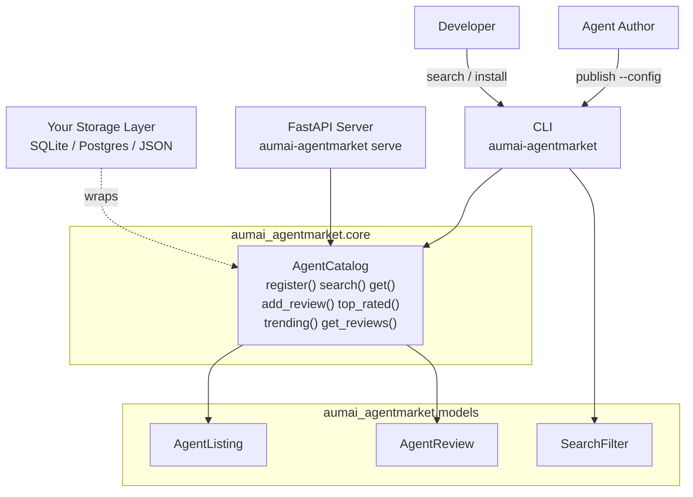

# aumai-agentmarket

> Marketplace for pre-built agents — publish, discover, rate, and deploy agents with standardized packaging and capability declarations.

[](https://github.com/aumai/aumai-agentmarket/actions)
[](https://pypi.org/project/aumai-agentmarket/)
[](LICENSE)
[](https://python.org)

Part of the [AumAI](https://github.com/aumai) open-source ecosystem for agentic AI infrastructure.

---

## What is this?

`aumai-agentmarket` is the **npm registry for AI agents** — a structured catalog where agents are first-class published artifacts with version numbers, capability declarations, ratings, and install commands.

Without a marketplace, agent reuse is manual and fragile: you copy a directory, paste a prompt, and hope the dependencies still match. With `aumai-agentmarket`, each agent is a formal **listing** (`AgentListing`) that declares what it can do (`capabilities`), who built it (`author`), how to install it (`install_command`), and how well it performs (`rating`). Users leave structured reviews (`AgentReview`) and the catalog dynamically recomputes mean ratings. You can find agents by text search, required capability, minimum quality bar, or tag combination.

The catalog (`AgentCatalog`) is deliberately I/O-agnostic — it holds state in memory so you can wrap it with any persistence layer. A FastAPI server (`aumai-agentmarket serve`) exposes the catalog over HTTP for team-wide sharing.

---

## Why does this matter?

### Agents are reusable components — but nobody treats them that way

Most teams build each new agent from scratch because there is no discovery mechanism. An engineer who solved "extract structured data from PDF invoices" last quarter has no way to publish that work so that a colleague building an accounts-payable workflow can reuse it. `aumai-agentmarket` provides that missing publishing and discovery layer.

### Capability declarations make composition tractable

A workflow that needs an agent capable of `["web_search", "citation_extraction"]` can query the marketplace for exactly that combination rather than reading documentation for every agent in the organization. Capability-based routing enables automated multi-agent orchestration.

### Rating signals reduce integration risk

Downloading an untested agent into a production pipeline is risky. The review system creates a social signal layer: an agent with a 4.8-star rating and 1,200 downloads carries a very different risk profile than a freshly published 1.0.0 with no reviews. `add_review()` recomputes the mean rating incrementally so the signal stays current.

---

## Architecture



---

## Features

- **Agent listing registration** — standardized manifest with `agent_id`, `name`, `description`, `version`, `author`, `capabilities`, `tags`, `install_command`, `license`, `rating`, `downloads`
- **Multi-field search** — combine text query, required capabilities (all must match), minimum rating, and required tags in a single `SearchFilter`
- **Results sorted by rating** — search always returns highest-rated matches first
- **Review system** — `AgentReview` objects with star rating (0–5) and comment; mean rating recomputed automatically as reviews arrive
- **Top-rated leaderboard** — `top_rated()` returns the N highest-rated agents globally
- **Trending feed** — `trending()` surfaces agents by total download count
- **FastAPI HTTP server** — `serve` command starts a REST API for multi-user or CI/CD usage (requires `uvicorn`)
- **Pydantic validation** — all inputs validated at construction time; `SearchFilter.min_rating` bounds-checked by a field validator
- **Click CLI** — `search`, `publish`, `serve`, `top-rated`, `get` commands

---

## Quick Start

### Installation

```bash
pip install aumai-agentmarket
```

### Publish an agent

Create an agent manifest `code-review-agent.json`:

```json
{
  "agent_id": "code-review-agent-v1",
  "name": "Code Review Agent",
  "description": "Automated code review with security, style, and complexity analysis.",
  "version": "1.2.0",
  "author": "AumAI Engineering",
  "capabilities": ["code_review", "security_analysis", "style_check"],
  "tags": ["code", "devops", "security"],
  "downloads": 0,
  "rating": 0.0,
  "license": "Apache-2.0",
  "install_command": "pip install aumai-agent-code-review"
}
```

```bash
aumai-agentmarket publish --config code-review-agent.json
# Agent 'code-review-agent-v1' published successfully.
```

### Discover agents

```bash
# Search by keyword
aumai-agentmarket search --query "code review"

# Filter by required capability and minimum quality bar
aumai-agentmarket search --capability code_review --capability security_analysis --min-rating 4.0

# Browse top-rated
aumai-agentmarket top-rated --limit 5
```

### Start the marketplace server

```bash
pip install uvicorn
aumai-agentmarket serve --host 0.0.0.0 --port 8000
```

---

## CLI Reference

### `aumai-agentmarket search`

Search the agent catalog. Results are sorted by rating descending.

```
Options:
  --query TEXT          Text search query (matches name and description).
  --min-rating FLOAT    Minimum star rating filter (0.0–5.0).
  --capability TEXT     Required capability (repeatable; all must match).
  --tag TEXT            Required tag (repeatable; all must match).
```

**Examples:**

```bash
# Keyword search
aumai-agentmarket search --query "invoice extraction"

# Capability filter with minimum rating
aumai-agentmarket search --capability pdf_parsing --capability structured_output --min-rating 4.5

# Tag filter
aumai-agentmarket search --query "data" --tag etl --tag python
```

---

### `aumai-agentmarket publish`

Publish an agent from a JSON manifest file whose keys match the `AgentListing` schema.

```
Options:
  --config PATH   Path to a JSON config file.  [required]
```

**Example:**

```bash
aumai-agentmarket publish --config ./manifests/my-agent.json
```

---

### `aumai-agentmarket serve`

Start the FastAPI marketplace HTTP server. Requires `uvicorn` (`pip install uvicorn`).

```
Options:
  --port INTEGER    HTTP port to listen on.  [default: 8000]
  --host TEXT       Bind address.  [default: 127.0.0.1]
```

**Example:**

```bash
aumai-agentmarket serve --host 0.0.0.0 --port 9000
```

---

### `aumai-agentmarket top-rated`

Show the highest-rated agents.

```
Options:
  --limit INTEGER   Number of results.  [default: 10]
```

**Example:**

```bash
aumai-agentmarket top-rated --limit 5
```

---

### `aumai-agentmarket get AGENT_ID`

Show full JSON details for an agent by ID. Exits with code 1 if the agent is not found.

**Example:**

```bash
aumai-agentmarket get code-review-agent-v1
```

---

## Python API

### Register and search agents

```python
from aumai_agentmarket import AgentCatalog, AgentListing, SearchFilter

catalog = AgentCatalog()

listing = AgentListing(
    agent_id="invoice-parser-v2",
    name="Invoice Parser Agent",
    description="Extracts structured data from PDF and image invoices.",
    version="2.0.1",
    author="AumAI Finance Team",
    capabilities=["pdf_parsing", "ocr", "structured_output"],
    tags=["finance", "invoices", "ocr"],
    license="Apache-2.0",
    install_command="pip install aumai-agent-invoice-parser",
)
catalog.register(listing)

results = catalog.search(SearchFilter(
    capabilities=["pdf_parsing"],
    min_rating=3.5,
))
for item in results:
    print(item.agent_id, item.rating)
```

### Add reviews and check updated rating

```python
from aumai_agentmarket import AgentReview

catalog.add_review("invoice-parser-v2", AgentReview(
    reviewer="alice@example.com",
    rating=4.8,
    comment="Handles multi-currency invoices flawlessly.",
))
catalog.add_review("invoice-parser-v2", AgentReview(
    reviewer="bob@example.com",
    rating=4.2,
    comment="Occasional issues with hand-written totals.",
))

updated = catalog.get("invoice-parser-v2")
print(updated.rating)  # 4.5 (mean of 4.8 and 4.2, rounded to 2dp)

for review in catalog.get_reviews("invoice-parser-v2"):
    print(review.reviewer, review.rating, review.comment)
```

### Leaderboards and trending

```python
# Top-rated agents
for agent in catalog.top_rated(limit=5):
    print(f"{agent.name}: {agent.rating:.1f}/5.0")

# Trending by total downloads
for agent in catalog.trending(limit=10):
    print(f"{agent.name}: {agent.downloads:,} downloads")
```

### Build a SearchFilter programmatically

```python
from aumai_agentmarket import SearchFilter

# All fields are optional; omit any field to skip that filter
text_only = SearchFilter(query="web scraping")
capability_filter = SearchFilter(capabilities=["web_search", "html_parsing"], min_rating=4.0)
combined = SearchFilter(
    query="data extraction",
    capabilities=["structured_output"],
    min_rating=4.5,
    tags=["production-ready"],
)
```

---

## Configuration

`AgentCatalog` is in-memory by default. Persist it by serializing listings to JSON on shutdown and restoring on startup:

```python
import json
from aumai_agentmarket import AgentCatalog, AgentListing

def save(catalog: AgentCatalog, path: str) -> None:
    data = [item.model_dump(mode="json") for item in catalog._listings.values()]
    with open(path, "w") as file_handle:
        json.dump(data, file_handle, indent=2)

def load(path: str) -> AgentCatalog:
    catalog = AgentCatalog()
    with open(path) as file_handle:
        records = json.load(file_handle)
    for rec in records:
        catalog.register(AgentListing.model_validate(rec))
    return catalog
```

---

## How It Works

### AgentCatalog

Internally maintains two structures: `_listings: dict[str, AgentListing]` keyed by `agent_id`, and `_reviews: dict[str, list[AgentReview]]` using `defaultdict(list)`.

**Search** is a linear scan against all listings. Each listing is tested in order: text match (substring on `name` + `description`), capabilities (set containment — all requested capabilities must appear), minimum rating (float comparison), and tags (set containment). Results are sorted by `rating` descending before return.

**`add_review()`** appends the review, then recomputes the mean rating as a simple sum/count over all reviews, stored rounded to 2 decimal places via `model_copy(update=...)`.

**`top_rated()`** sorts all listings by `rating` descending and slices to `limit`. **`trending()`** sorts by `downloads` descending as a proxy for recent adoption.

### SearchFilter validator

`SearchFilter.min_rating` is validated by a Pydantic `@field_validator` that enforces the `[0.0, 5.0]` range in addition to the `ge`/`le` field constraints — defense-in-depth input validation.

---

## Integration with Other AumAI Projects

| Project | Integration |
|---|---|
| `aumai-datacommons` | Reference training/evaluation `dataset_id` values in `AgentListing` metadata to declare data provenance |
| `aumai-specs` | Use aumai-specs contracts to formally declare the input/output schema of published agents |
| `aumai-sovereignstack` | Tag agents with jurisdiction constraints; sovereign deployments can filter the marketplace to compliant agents only |

---

## Documentation

- [Getting Started](docs/getting-started.md)
- [API Reference](docs/api-reference.md)
- [Examples](examples/)
- [Contributing](CONTRIBUTING.md)

---

## Contributing

See [CONTRIBUTING.md](CONTRIBUTING.md). All contributions require type hints on every function signature, tests alongside implementation (pytest + hypothesis), `ruff` and `mypy --strict` passing, and conventional commit messages (`feat:`, `fix:`, `refactor:`, `docs:`, `test:`, `chore:`).

---

## License

Apache 2.0 — see [LICENSE](LICENSE) for details.

---

## Part of AumAI

This project is part of [AumAI](https://github.com/aumai) — open source infrastructure for the agentic AI era.
